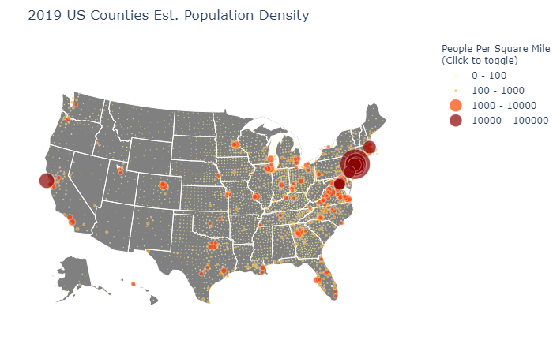
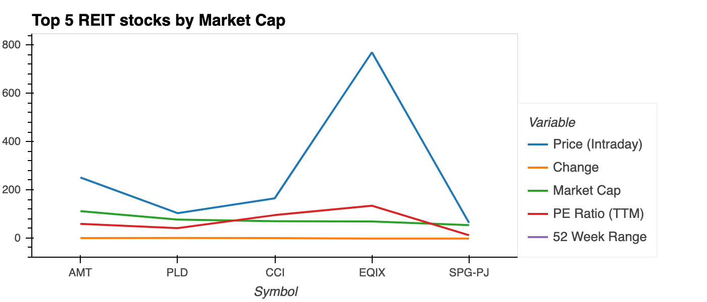
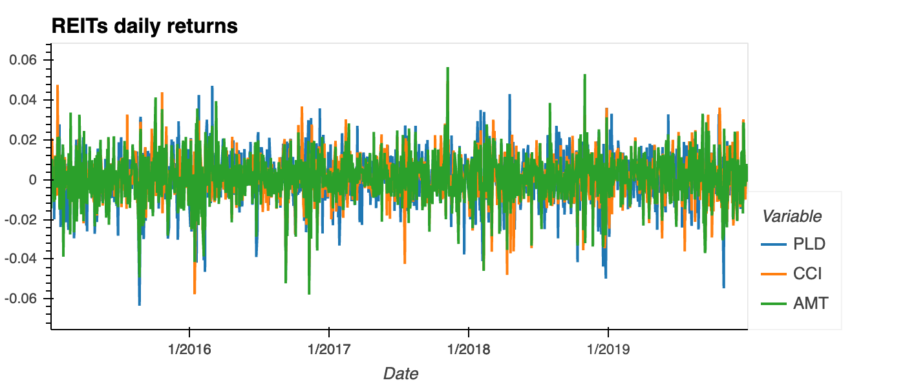
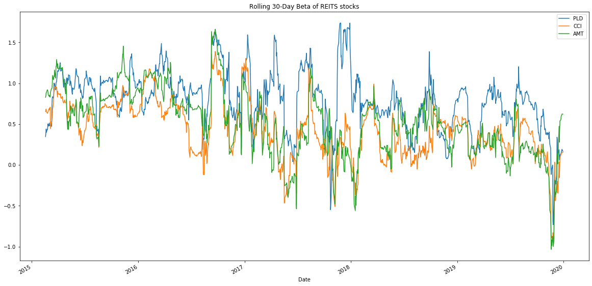

# FinTech Bootcamp Project 1 *Real Estate vs Security*
### Group 2
##### Members
* Aaron Sechler
* Franklin Bueno
* George Cruz
* King Leung
---

## Introduction:
- Is it worth it to invest in US real estate? How much money can one make by investing in real estate (investment in real estate = buying a property to rent out)?
- What makes an ideal real estate market for an investor?
- How can we use what we have learned up to this point to find an ideal real estate market?
- How can we use what we have learned up to this point to predict earnings from an investment in real estate?
- What is a Real Estate Investment Trust (REIT)? REIT = stock for real estate.
- How does investing in real estate compare with investing in other investment vehicles (Real Estate Investment Trusts (REITs), Stock Indices, etc.)?
- How can we leverage what we have learned so far to predict the value of investments?

---

### Real Estate Data Gathering and Preparation:
###### notebook: https://github.com/klleung72781/fintech_project_1/blob/master/data_gathering.ipynb

1. **Demand**: finding the most densely populated counties in the US, since population density is not a readily available stat, we used 2 datapoints to yield the desired results.
    - Since 2019 is not a census year, we decided to use the 2019 population estimate available on Census.gov:\
        https://www.census.gov/programs-surveys/popest/technical-documentation/file-layouts.html
    - Population density = Population / Land Area (this was obtained from Census TIGER/Line shapefiles):
        https://www.census.gov/geographies/mapping-files/time-series/geo/tiger-line-file.html\
        The county `shp` file also contains latitudes and longitudes of each county, useful for plotting on a map.
        
        **Top 10**
        | County Name | Population Density (*People per Sq. Mile*) | 
        | ----------- | ----------- |
        | **New York County** New York | 71874 |
        | **Kings County** New York | 36901 |
        | **Bronx County** New York | 33727 |
        | **Queens County** New York | 20720 |
        | **San Francisco County** California | 18795 |
        | **Hudson County** New Jersey | 14556 |
        | **Suffolk County** Massachusetts | 13801 |
        | **Philadelphia County** Pennsylvania | 11797 |
        | **District of Columbia** | 11544 |
        | **Alexandria city** (Census County)  Virginia | 10675 |

2. **Market Value**:  finding the counties with the highest median income
    - CensusData python library provides easy access to the data\
        https://pypi.org/project/CensusData/
    - Combining the data with TIGER/Line shapefiles to create a bubble map visualization\
        
        **Top 10**
        | County Name | Median Household Income (*USD*) | 
        | ----------- | ----------- |
        | **Los Angeles County** California | 1514629.0 |
        | **Cook County** Illinois | 1116759.0 |
        | **Maricopa County** Arizona | 933112.0 |
        | **Harris County** Texas | 865645.0 |
        | **San Diego County** California | 593890.0 |
        | **Orange County** California | 592269.0 |
        | **King County** Washington | 494443.0 |
        | **Riverside County** California | 472401.0 |
        | **Dallas County** Texas | 459974.0 |
        | **Miami-Dade County** Florida | 449056.0 |

3. **Other deciding factors**: gather additional dataset of counties that are both top 100 in population density and income in an attempt to locate a hidden gem...
    - Capital Gain (*Median Home Value per Sq. Foot*)
    - Potential Income (*Price to Rent Ratio*)
    - Operating Costs (*Real Estate Tax Rate*)
    
    - With an assumed investment of $1 million, identify the 10 best-performing counties\
        **Top 10**
        | County Name | Total Proceeds (*USD*) | 
        | ----------- | ----------- |
        | **Wayne County** Michigan | 3169917 |
        | **Macomb County** Michigan | 2553876 |
        | **DeKalb County** Georgia | 2522056 |
        | **Alameda County** California | 2500199 |
        | **Broward County** Florida | 2489344 |
        | **Sacramento County** California | 2479974 |
        | **Pinellas County** Florida | 2470103 |
        | **Dallas County** Texas | 2449903 |
        | **San Mateo County** California | 2434183 |
        | **Contra Costa County** California | 2421439 |

4. **Neighborhood Data**: Only 342 out of the 1240 neighborhoods had Zillow data\
    
    **Top 10**
    | Neighborhood | City | State | Total Proceeds (*USD*) |
    | ----------- | ----------- | ----------- | ----------- |
    | Twinbrooks | Saint Petersburg | FL | 5164450 |
    | Winnetka Heights | Dallas | TX | 4605207 |
    | Childs Park | Saint Petersburg | FL | 4350882 |
    | Westminster Heights | Saint Petersburg | FL | 4165232 |
    | Central Oak Park | Saint Petersburg | FL | 3902721 |
    | Highland Oaks | Saint Petersburg | FL | 3817110 |
    | Lake Maggiore | Saint Petersburg | FL | 3753632 |
    | Harris Park | Saint Petersburg | FL | 3690029 |
    | Lake Euclid | Saint Petersburg | FL | 3655180 |
    | Iveywood | Oakland | CA | 3646354 |
    - **Twinbrooks in Saint Petersburg, FL** turns out to the hidden gem according to this analysis with a 500% return over 7 years.

---

### REITs Data Gathering and Preparation:
###### notebook: https://github.com/klleung72781/fintech_project_1/blob/master/REIT.ipynb
###### REITS are an alternative investment option to those that want to invest in real estate, but do not have the funds to buy property or simply do not qualify for mortgage. Reits historically have delivered competitive high returns based on long term capital appreciation. This analysis will use hvplots visualizations to plot the top 15 REITS by market CAP, calculate rolling statistics, betas and compare them to the trends of S&P 500 market Cap index over time.

1. **Identify the REITs**: This section analyzes the Top 15 REITs by Market Cap (data acquired from Yahoo! Finance)
    - This analysis will use hvplots visualizations to plot the top 15 REITS by market CAP.\
    .png)
    - Plotting the top 5 in details
        | Symbol | Name | Market Cap (*Billion*) |
        | ----------- | ----------- | ----------- |
        | AMT | American Tower Corporation (REIT) | 111.217 |
        | PLD | Prologis, Inc. | 75.827 |
        | CCI | Crown Castle International Corp. (REIT) | 68.977 |
        | EQIX | Equinix, Inc. (REIT) | 68.200 |
        | SPG-PJ | Simon Property Group, Inc. | 52.987 |
        
2. **REITs in details**: Import and clean the data of 3 largest REIT stocks by Market Cap while combining them into a portfolio
    - Cumulative Returns
        
    - Daily Returns
        
3. **Compare to S&P 500**: Finding the beta against S&P 500
    - Calculate 30-Day Rolling Betas of REIT Stock Returns vs. S&P 500 Returns
        

---

## Conclusion:
- It is important to return to the initial hypotheses. The main null hypothesis is that investment in physical real estate property does not provide a greater return than an investment in any combination of REITs and stock indices. In the determination of the ideal real estate market for the purchase of property, there were two supporting hypotheses. One ancillary hypothesis is that population density does not have any relationship with real estate property values. Another ancillary hypothesis is that median household income does not have any relationship with real estate property values.

- One could both make and win the argument that the supporting null hypotheses were disproven with the tabulation of the data and the construction of the maps. The highest real estate property values had an association with population density. In addition, the highest real estate property values had an association with median household income.

- With the strong possibility of synergistic relationships among population density, median household income, and real estate property values, an ideal real estate market was identified. This market was identified as Saint Petersburg, Florida. Given a set investment of a fixed sum over a given period, this investment would have provided a return that far outweighs the returns from any investment in REITs or stock indices. In addition, this set investment may not be complete in that this set investment may not include the collections from renting the supposed property.

- It is important to reassert the ancient disclaimer that past performance does not guarantee future results. Nobody can determine future events, and in the case that anyone could determine future events, then that person would behave accordingly. The exercises of Group Two serve to provide the reader with an analysis of data to this point. Based on the data, it was possible to select for high value real estate markets based on population density. Furthermore, based on the data, it was possible to select for high value real estate markets based on median household income. This data was used to filter down to a specific select real estate market. The comparison with the historical returns from combinations of REITs and stock market indices established that investment in real estate property brought a higher return. Given the extra benefits of physical ownership and the flexibility to rent the property, one can disprove the overarching null hypothesis. It is better to invest in physical real estate than in REITs and stocks.

